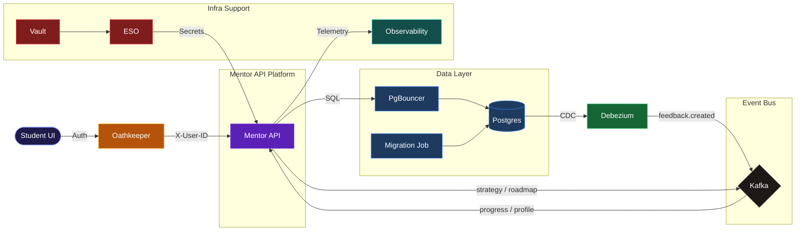

# mentor-api

[](https://github.com/MathTrail/mentor-api/actions)
[](https://github.com/MathTrail/mentor-api/releases)
[](https://goreportcard.com/report/github.com/MathTrail/mentor-api)
[](https://codecov.io/gh/MathTrail/mentor-api)
[](https://github.com/MathTrail/mentor-api/blob/main/go.mod)
[](https://pkg.go.dev/github.com/MathTrail/mentor-api)

[](https://sonarcloud.io/summary/new_code?id=MathTrail_mentor-api)
[](https://sonarcloud.io/summary/new_code?id=MathTrail_mentor-api)
[](https://sonarcloud.io/summary/new_code?id=MathTrail_mentor-api)
[](https://sonarcloud.io/summary/new_code?id=MathTrail_mentor-api)
[](https://sonarcloud.io/summary/new_code?id=MathTrail_mentor-api)
[](https://sonarcloud.io/summary/new_code?id=MathTrail_mentor-api)
[](https://sonarcloud.io/summary/new_code?id=MathTrail_mentor-api)

Mentor API is the intelligence hub of the MathTrail platform, responsible for adapting the learning experience to each individual student. The service analyses feedback, tracks progress, and generates personalised learning recommendations.

## Business Capabilities

- **Feedback Analysis** — Interprets student feedback on task difficulty using an LLM.
- **Learning Roadmaps** — Generates adaptive learning paths based on each student's current progress.
- **Strategy Orchestration** — Determines the optimal teaching strategy to adjust content difficulty.

## System Architecture

[](https://www.postgresql.org/)
[](https://debezium.io/)
[](https://kafka.apache.org/)
[](https://flink.apache.org/)

[](https://aws.amazon.com/event-driven-architecture/)
[](./infra/helm/mentor-api)
[](https://www.vaultproject.io/)

[](https://MathTrail.github.io/mentor-api/)
[](https://opentelemetry.io/)
[](https://pyroscope.io/)



## Development

All commands are run via `just`.

```bash
just deploy
just k6-load
```

## Debug

[Telepresence](https://www.telepresence.io/) intercepts live cluster traffic and routes it to your local process, so you can debug against real dependencies without deploying.

```bash
just tp-intercept
go run ./cmd/server/main.go

just tp-stop
```

## Releases

```bash
git tag -a v0.2.0 -m "Release description"
git push origin v0.2.0
```

GitHub Actions will build binaries, generate a Changelog, and publish a GitHub Release.
